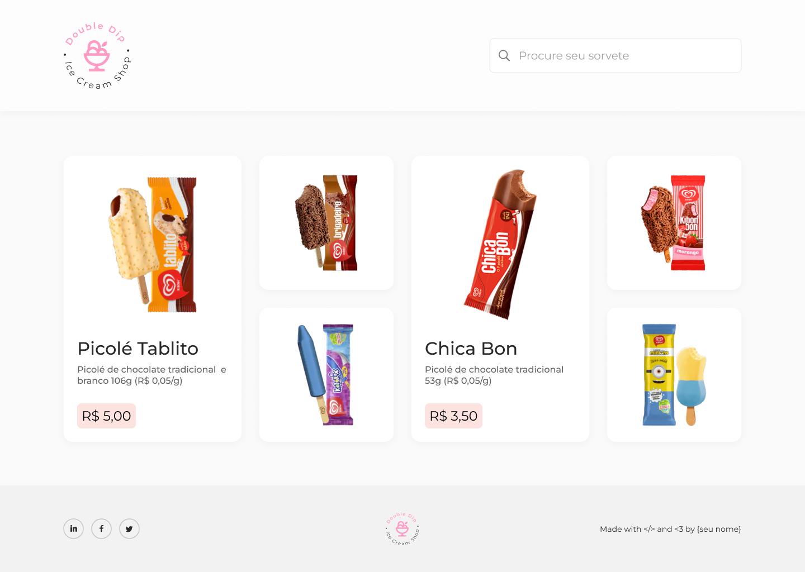

# Double Dip - Ice Cream Shop

> Uma página de exibição de produto. Contêm uma sessão com os sabores de sorvetes disponíveis para exibição.

## 💻 Tecnologias utilizadas

- HTML:
  - Anatomia de um documento
  - Tags
  - Elementos
  - Semântica
- CSS
  - Seletores, Propriedades e Valores
  - Flexbox
  - Media Queries

## 🚀 Introdução

Página única criada para o desafio de HTML/CSS no PTA do Citi. Tem como função ser uma atividade para praticar os conceitos aprendidos durante o treinamento. Por isso, é um projeto que visa utilizar conceitos de responsividade, estilização de elementos e criação dos mesmos.

## 📫 Idealização

Para ser desenvolvido, o modelo foi construído no <a href="https://www.figma.com/file/m7YeWlZU1GpjPbqkhFdXSj/PTA-de-Dev?t=2dvhowExRpPOUmQ3-1">Figma</a>.

## 🤝 Desenvolvedora

<table>
  <tr>
    <td align="center">
      <a href="#">
         
        
          <b>Júlia Andrade</b>
        
      </a>
    </td>
  </tr>
</table>
